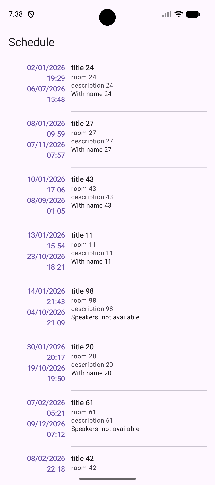
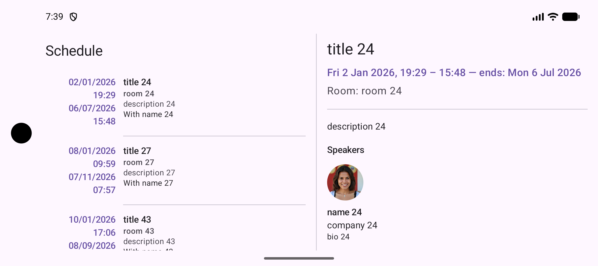
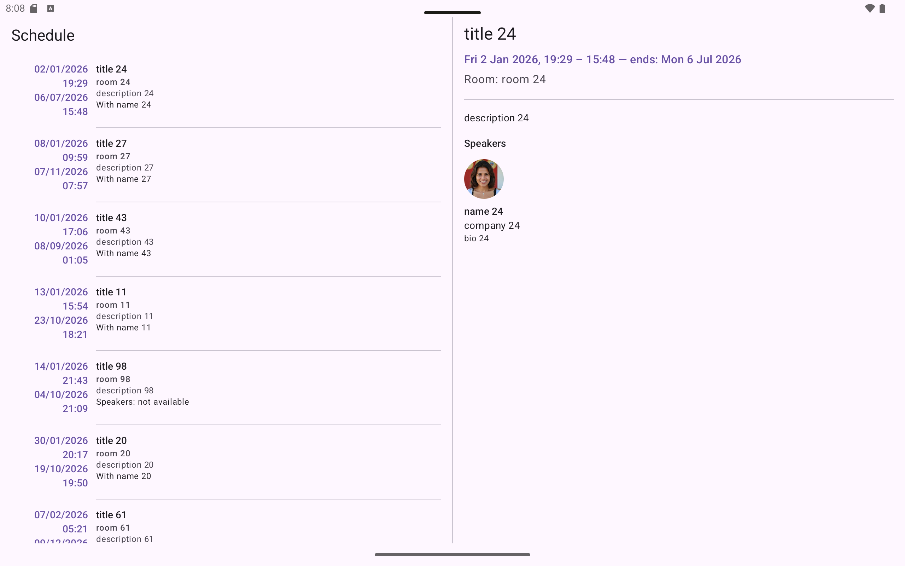
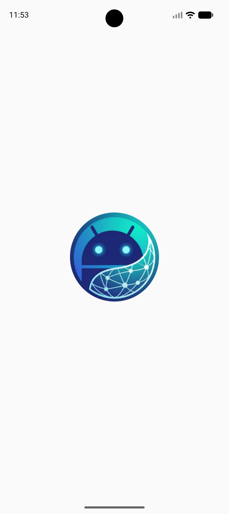

# Conference IO Demo - Starter Code

This is the starter code for a Kotlin Multiplatform project targeting Android and iOS platforms. This repository provides the foundational project structure and basic domain models to get started building a conference management application.

## What's Included

This starter code provides:

- **Project Structure**: Pre-configured Kotlin Multiplatform modules (composeApp, shared, iosApp)
- **Domain Models**: Basic `Session` and `Speaker` data classes with kotlinx.serialization
- **Platform Setup**: Android and iOS application entry points configured
- **Build Configuration**: Gradle build scripts with Compose Multiplatform dependencies
- **Package Structure**: Organized using `com.droidcon.global` namespace

## 🛠️ Prerequisites & Environment Setup

Before you clone & run this starter code, you must ensure your development environment is set up correctly for Kotlin Multiplatform (KMP) development.

KMP requires tooling from both the Android and Apple ecosystems to compile native apps for both platforms.

> **⚠️ Critical Hardware Requirement:**
> To build and run the **iOS** application, you **must** be using a Macintosh computer running macOS. Windows and Linux users will only be able to build and run the Android application.

Please complete the following steps in order to configure your machine.

### Step 1: Install Xcode (macOS Only)

To compile the iOS app, you need Apple's official development environment.

1. **Download Xcode:** Install the latest stable version of **Xcode** from the Mac App Store. *Note: This is a large download.*
2. **Accept License & Install Components:** Once installed, open Xcode at least once. It will prompt you to install additional components and accept the license agreement. You must agree to proceed.
3. **Install Command Line Tools:** Open your terminal and run the following command to install necessary build tools:
   ```bash
   xcode-select --install
   ```

4. **Download Simulator Runtime:** In Xcode, go to **Settings > Platforms** and ensure you have downloaded at least one iOS Simulator runtime (e.g., iOS 17.x).

### Step 2: Install Android Studio (All OS)

Android Studio is the primary IDE we will use for writing code on both platforms.

1. **Download:** Download and install the latest stable version of **Android Studio** from the official website.
2. **Setup Wizard:** During the initial setup wizard, ensure the following components are checked for installation:
   - Android SDK
   - Android SDK Platform
   - Android Virtual Device (AVD)

3. **Verify SDK:** Open Android Studio, go to **Settings/Preferences > Languages & Frameworks > Android SDK**, and ensure the "Android SDK Command-line Tools" are installed under the "SDK Tools" tab.

### Step 3: The Final Check - KDoctor (macOS Only)

To ensure all the complex moving parts between Java, Android, and Xcode are configured correctly, we use a diagnostic tool from JetBrains called **KDoctor**.

1. **Install KDoctor** via Homebrew by running this command in your terminal:
   ```bash
   brew install kdoctor
   ```

2. **Run Diagnostics:** Run the tool by typing:
   ```bash
   kdoctor
   ```

**Your Goal:** KDoctor should output green checkmarks `[v]` next to the following sections:

- [v] System
- [v] Java
- [v] Android Studio
- [v] Xcode

If you see any red failures `[x]`, KDoctor will provide specific commands to fix them. Run those commands and rerun `kdoctor` until everything is green.

*(Note: You may ignore warnings regarding CocoaPods if they appear, as this project does not heavily rely on them.)*

---

**✅ Once your environment is set up, you are ready to clone this repository and open it in Android Studio!**

### Project Requirements

- **Android Minimum SDK**: API 24 (Android 7.0)
- **Android Compile SDK**: As defined in `gradle/libs.versions.toml`
- **macOS Version**: Version 12.0 (Monterey) or later (for iOS development)
- **iOS Deployment Target**: As configured in the Xcode project

## Project Structure

```
ConferenceIODemo/
├── composeApp/              # Compose Multiplatform application module
│   ├── src/
│   │   ├── androidMain/     # Android-specific implementations
│   │   ├── commonMain/      # Shared UI and business logic
│   │   ├── iosMain/         # iOS-specific implementations
│   │   └── commonTest/      # Shared unit tests
│   └── build.gradle.kts     # App module build configuration
│
├── shared/                  # Shared business logic module
│   └── src/
│       ├── commonMain/      # Domain models and common code
│       └── androidMain/     # Android-specific shared code
│
├── iosApp/                  # iOS application entry point
│   └── iosApp/             # SwiftUI app code and Xcode project
│
├── gradle/                  # Gradle wrapper and version catalog
├── build.gradle.kts         # Root build configuration
└── settings.gradle.kts      # Project settings
```

### Included Domain Models

Located in `shared/src/commonMain/kotlin/com/droidcon/global/domain/model/`:

**Session.kt**
```kotlin
data class Session(
    val id: String,
    val title: String,
    val description: String,
    val startTime: String,
    val endTime: String,
    val room: String,
    val speakerId: String,
    val isServiceSession: Boolean
)
```

**Speaker.kt**
```kotlin
data class Speaker(
    val id: String,
    val name: String,
    val bio: String,
    val avatar: String,
    val company: String,
    val sessionId: String
)
```

Both models are annotated with `@Serializable` for kotlinx.serialization support.

## Getting Started

### Clone the Repository

```bash
git clone https://github.com/federicomartini/cd0638-Cross-Platform-And.git
cd cd0638-Cross-Platform-And
```

### Build and Run Android Application

**Using Android Studio:**
1. Open the project in Android Studio
2. Wait for Gradle sync to complete
3. Select the `composeApp` run configuration
4. Click the Run button or press `Shift + F10`

**Using Command Line:**

- On macOS/Linux:
  ```bash
  ./gradlew :composeApp:assembleDebug
  ```

- On Windows:
  ```bash
  .\gradlew.bat :composeApp:assembleDebug
  ```

To install on a connected device or emulator:
```bash
./gradlew :composeApp:installDebug
```

### Build and Run iOS Application

**Prerequisites:** Must be on macOS with Xcode installed

**Using Android Studio:**
1. Select the `iosApp` run configuration
2. Choose an iOS Simulator
3. Click the Run button

**Using Xcode:**
1. Open the `iosApp` directory in Xcode:
   ```bash
   open iosApp/iosApp.xcodeproj
   ```
2. Select a simulator or connected iOS device
3. Click the Run button or press `Cmd + R`

## Application Screenshots

The following screenshots show the application running on an Android Studio Pixel 10 emulator.

### Android - Session List

Conference sessions loaded from the remote API and persisted locally for offline access.



### Android - Session Detail (Phone Navigation)

Smartphone detail page opened from the list with in-app back navigation support.



### Android - Speaker Information and Avatar (Tablet Landscape)

Session detail showing speaker fields (`name`, `company`, `bio`, `avatar`, IDs), with avatar fallback behavior.



### Android - Additional Runtime State

Additional runtime capture of the app interaction flow on emulator.



## Next Steps

This starter code provides the foundation. You can now:

1. Implement API integration to fetch sessions and speakers
2. Create UI screens to display conference data
3. Add navigation between screens
4. Implement state management
5. Add error handling and loading states
6. Customize the UI theme and styling

### API Endpoints (For Reference)

The following mock APIs are available for development:

- **Sessions API**: `https://694e2d80b5bc648a93bf8dd0.mockapi.io/api/v1/sessions`
- **Speakers API**: `https://694e2d80b5bc648a93bf8dd0.mockapi.io/api/v1/sessions/:id/speakers`

For detailed API response structures, see [`plan/api_response_updated.md`](./plan/api_response_updated.md)

## Package Structure

All code uses the `com.droidcon.global` namespace:

- `com.droidcon.global` - Main application code and UI
- `com.droidcon.global.domain.model` - Domain models (Session, Speaker)

## Technology Stack

- **Kotlin Multiplatform**: Shared code across platforms
- **Compose Multiplatform**: Declarative UI framework
- **kotlinx.serialization**: JSON serialization/deserialization
- **Gradle**: Build system with Kotlin DSL
- **Material 3**: Modern UI design system

## Troubleshooting

### Common Issues

1. **Gradle Sync Failed**
   - Ensure you have a stable internet connection
   - Try: File → Invalidate Caches → Invalidate and Restart
   - Check that JDK 11+ is configured in Android Studio

2. **iOS Build Errors**
   - Ensure Xcode Command Line Tools are installed: `xcode-select --install`
   - Clean build folder in Xcode: Product → Clean Build Folder
   - Update CocoaPods: `sudo gem update cocoapods`

3. **Package Name Errors**
   - Ensure all files use `com.droidcon.global` package namespace
   - Clean and rebuild: `./gradlew clean build`

## Learn More

- [Kotlin Multiplatform Documentation](https://www.jetbrains.com/help/kotlin-multiplatform-dev/get-started.html)
- [Compose Multiplatform](https://www.jetbrains.com/lp/compose-multiplatform/)
- [Kotlin Documentation](https://kotlinlang.org/docs/home.html)
